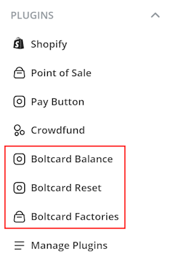
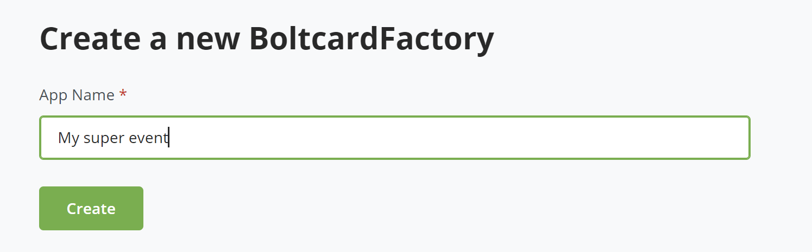
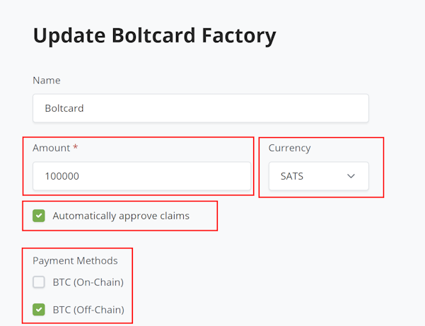
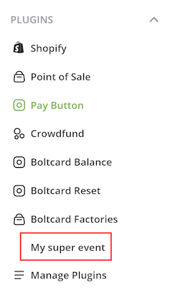

# Boltcard plugin

This plugin enhances your BTCPay Server with three new features:

* Boltcard factories
* Boltcard Balance
* Boltcard Reset

 

### Boltcard factories

If you need to program a large batch of Boltcards, this plugin allows you to do so efficiently.

1. Click on the `Boltcard Factories` plugin in the sidebar.
2. Choose a name for your factory.

3. A pull payment will be created for each newly programmed Boltcard. Select the model settings that will be used for such pull payments.
4. Note that we currently support only `BTC` or `SATS` as currencies, and you should check `Automatically approve claims` and `BTC (Off-Chain)` payment methods.

5. After saving, select your factory.

6. Then click on `View`
7. If you are not on mobile, you will see a QR code to scan to open the page on a mobile device.
8. Install the `Bolt Card NFC Card Creator` on your mobile ([iOS](https://apps.apple.com/us/app/boltcard-nfc-programmer/id6450968873) or [Android](https://play.google.com/store/apps/details?id=com.lightningnfcapp&pcampaignid=web_share))
9. You can then program Boltcards one by one through the app, as shown in the following video.

See this video for more information:

### Boltcard Balance

This feature allows a user to consult the balance of a programmed Boltcard.

If you are not on mobile, clicking on `Boltcard Balance` will display a QR code that you can scan on a mobile device to consult balances.

By scanning this QR code, you can easily view the history of your transactions with the Boltcard.

You can also access a QR code in the balance view of the Boltcard for topping up.

See this video for more information:

### Boltcard Reset

This plugin is similar to `Boltcard Balance` but enables a user to easily sweep funds from a Boltcard and reset it.

By resetting a Boltcard, you can reprogram it.

See this video for more information:

